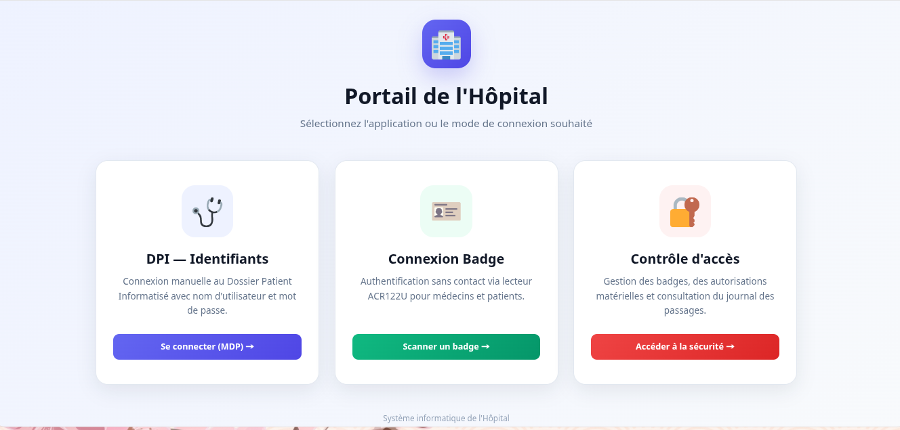
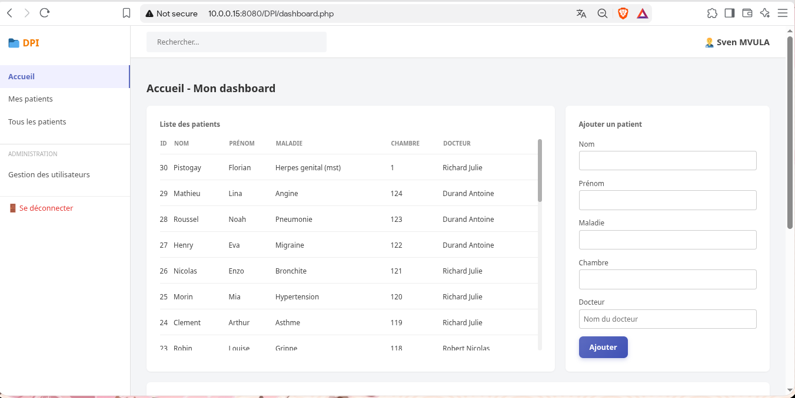
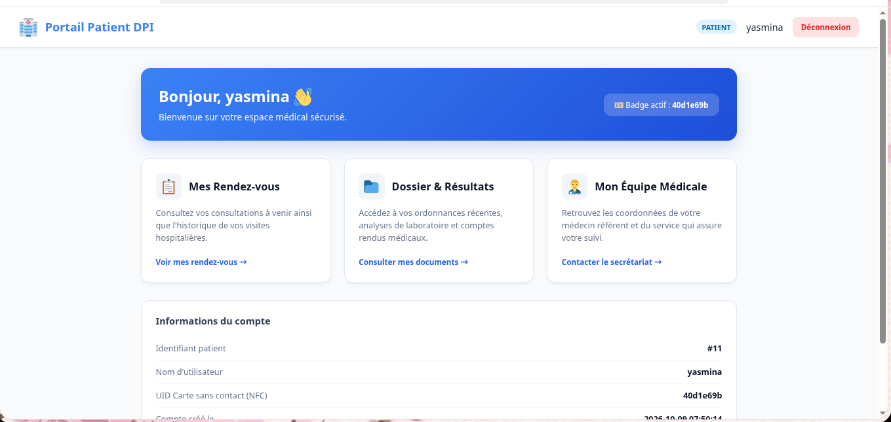
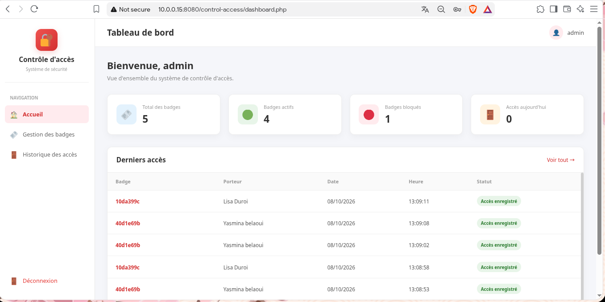

# 🏥 Portail Hospitalier — DPI & Contrôle d'Accès NFC

[](https://www.docker.com/)
[](https://www.php.net/)
[](https://mariadb.org/)
[](#-fonctionnement-du-scan-nfc)

Plateforme web hospitalière conteneurisée permettant la gestion du **Dossier Patient Informatisé (DPI)** et le **Contrôle d'accès physique aux locaux**, intégrant une authentification double-mode : classique (identifiants / mot de passe) et **sans contact via lecteur RFID/NFC (ACR122U)**.

---

## 📸 Aperçu de l'Interface

### 🚪 Portail d'Aiguillage
Point d'entrée central permettant de choisir l'application cible ou de lancer une session instantanée sans contact.

<p align="center">
  
</p>

---

### 🩺 Dossier Patient Informatisé (DPI)
Selon le rôle associé au badge scanné ou aux identifiants saisis, l'utilisateur est automatiquement redirigé vers l'interface dédiée :

<p align="center">
  
  
</p>

<p align="center">
  <em>À gauche : Tableau de bord médical (Docteur) &nbsp;|&nbsp; À droite : Espace de suivi sécurisé (Patient)</em>
</p>

---

### 🔐 Gestion du Contrôle d'Accès
Module de supervision de la sécurité physique : journalisation des accès, attribution et révocation des cartes RFID du personnel.

<p align="center">
  
</p>

---

## ✨ Fonctionnalités Principales

- **Authentification Double-Mode :**
  - Connexion standard sécurisée (`password_hash` / `password_verify`).
  - Connexion automatique par carte/badge NFC (Mifare, Ultralight, NTAG).
- **Routage Dynamique par Rôle :**
  - Si `role = 'docteur'` ➔ Accès à la gestion des dossiers et observations (`dashboard.php`).
  - Si `role = 'patient'` ➔ Accès à l'espace patient personnel (`espace_patient.php`).
- **Pipeline NFC Asynchrone :**
  - Écoute matérielle via `nfc-poll` (libnfc) sur lecteur USB ACR122U.
  - Transmission sécurisée par API avec Bearer Token.
  - File d'attente tampon MySQL (`badge_login_queue`) et polling AJAX (800 ms) pour une réactivité instantanée.
- **Conteneurisation Complète :**
  - Déploiement multi-conteneurs (Apache/PHP + MariaDB + phpMyAdmin).
  - Initialisation automatique de la base de données au premier lancement via `init-db/sauvegarde.sql`.

---

## 🔄 Fonctionnement du Scan NFC

```mermaid
sequenceDiagram
    autonumber
    actor User as Utilisateur (Docteur / Patient)
    participant Reader as Lecteur ACR122U
    participant Bash as Script Bash (scan_login_nfc.sh)
    participant API as api_login_badge.php
    participant DB as MariaDB (DPI)
    participant Check as check_scan_login.php
    participant Nav as Page d'attente (login_badge_auto.php)

    Nav->>Check: Polling AJAX régulier (GET check_scan_login.php)
    User->>Reader: Présentation du badge RFID / NFC
    Reader->>Bash: Extraction de l'UID (nfc-poll)
    Bash->>API: HTTP POST {uid, token}
    API->>DB: INSERT UID dans badge_login_queue
    Check->>DB: Récupère l'UID et vérifie users (role)
    Check->>DB: Supprime le scan (badge_login_queue)
    Check-->>Nav: JSON {scanned: true, role: "docteur|patient", redirect: "..."}
    Nav->>User: Redirection automatique vers le Dashboard approprié
